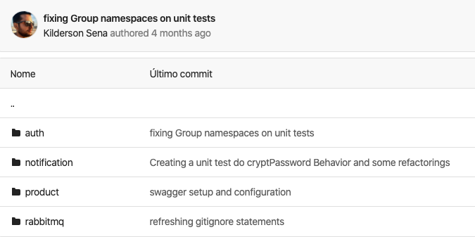
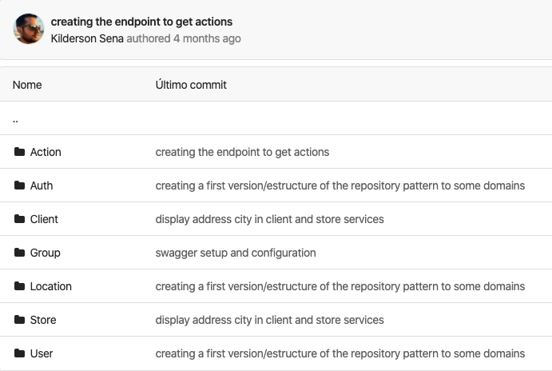

# PHP | Análise Habilidades Técnica

## Índices Financeiros

#### Resumo

Repositório: [dersonsena/indices-financeiros](https://github.com/dersonsena/indices-financeiros)

Esse componente foi criado em 2018 pois na empresa em que eu trabalhava havia uma necessidade muito rotineira na aplicação que era obter as taxas de índices financeiros para fazer reajustes contratuais das imobiliárias.

#### Especificações Técnicas

Apesar de ser um componente relativamente pequeno, o que mais se destaca nesse projeto, no meu ponto de vista, é a **boa abstração**, **baixo acoplamento** das entidades e aplicação de alguns **princípios e boas práticas**.

- [src/Indices](https://github.com/dersonsena/indices-financeiros/tree/master/src/Indices) - aqui você poderá ver todos os possíveis índices, e caso seja necessário criar outro índice, basta criar uma classe dentro desse pacote e a mesma extender `IndiceFinanceiroAbstract`;

- [src/Services](https://github.com/dersonsena/indices-financeiros/tree/master/src/Services) - nesse pacote você verá todas as fonte de consulta de índice. Atualmente só existe implementação do [Debit](https://www.debit.com.br) como fonte de consulta, mas da forma de como foi projetado é muito fácil adicionar outras fontes, pois esses serviços estão "amarradas" na interface `ServiceInterface`.

- [src/Services/Debit](https://github.com/dersonsena/indices-financeiros/tree/master/src/Services/Debit) - seguindo o Princípio da Responsabilidade Única ([SRP](https://blog.cleancoder.com/uncle-bob/2014/05/08/SingleReponsibilityPrinciple.html)) é bem notório a separação de responsabilidades nas classes desse pacote, onde temos a `DebitService` que é a classe principal do serviço e as outras classes que auxiliaram na captura das informações.

## Go! Sale API

#### Resumo

Esse é um **projeto privado** que está em fase de desenvolvimento. Essa é uma API que serve um aplicativo mobile e também uma aplicação web para gestão de vendas no varejo.

#### Especificações Técnicas

Nessa API foram adotadas:

- Arquitetura de microserviços em conjunto com a Clean Architecture;

- Todos os microserviços foram desenvolvidos com PHP;

- Testes de unidade e de Integração;

- Domain-Driven Design;

- Test-Driven Development;

- Documentação de alguns microserviços feito com com [Swagger](https://swagger.io);

- Todos os microserviços "containizados" com Docker;

- [RabbiMQ](https://www.rabbitmq.com) como sistema de filas e mensageiria.

##### Testes

```php
namespace Tests\Unit\Domain\User;

use Tests\TestCase;
use App\Domain\User\User;

class UserTest extends TestCase
{
    protected function setUp(): void
    {
        $this->mockApplicationWithDB();
    }

    public function testVerifyRegistredBehaviors()
    {
        $user = new User();

        $behaviors = array_map(function ($item) {
            return $item['class'];
        }, $user->behaviors());

        $this->assertCount(6, $behaviors);
    }
}
```

```php
namespace Tests\Unit\Domain\User\Behaviors;

use App\Domain\Client\Client;
use App\Domain\Group\Group;
use App\Domain\User\Behaviors\RefreshAuthKey;
use App\Domain\User\User;
use Tests\TestCase;

class RefreshAuthKeyTest extends TestCase
{
    /**
     * @var RefreshAuthKey
     */
    private $refreshAuthKey;

    protected function setUp(): void
    {
        $this->mockApplicationWithDB();

        /** @var Group $group */
        $group = $this->getMockBuilder(Group::class)
            ->disableOriginalConstructor()
            ->setMethods(['attributes'])
            ->getMock();

        $group->method('attributes')->willReturn(['uuid', 'name']);
        $group->uuid = 'fd3dc7b8-0c65-11ea-8d71-362b9e155667';
        $group->name = 'Unit test Group';

        /** @var Client $client */
        $client = $this->getMockBuilder(Client::class)
            ->disableOriginalConstructor()
            ->setMethods(['attributes'])
            ->getMock();

        $client->method('attributes')->willReturn(['uuid', 'name']);
        $client->uuid = '1cfaaa26-0c66-11ea-8d71-362b9e155667';
        $client->name = 'Unit test Client';

        /** @var User $user */
        $user = $this->getMockBuilder(User::class)
            ->disableOriginalConstructor()
            ->setMethods(['attributes', 'getGroup', 'getClient'])
            ->getMock();

        $user->method('attributes')->willReturn(['uuid', 'name', 'email', 'auth_key', 'group_id', 'client_id']);
        $user->method('getGroup')->willReturn($group);
        $user->method('getClient')->willReturn($client);

        $user->uuid = '2283000c-0c60-11ea-8d71-362b9e155667';
        $user->name = 'Unit Test User';
        $user->email = 'unittest@domain.com';
        $user->auth_key = 'eyJhbGciOiJIUzI1NiIsInR5cCI6IkpXVCJ9.eyJpc3MiOiJodHRwOlwvXC9sb2NhbGhvc3Q6ODAwMCIsInN1YiI6ImFkMzM2ZmYwLWRhZmQtMTFlOS05ZTYyLTAyNDJhYzEzMDAwMyIsImlhdCI6MTU3MDU2OTYxNiwiZXhwIjoxNTcwNTczMjE2LCJ1dWlkIjoiYWQzMzZmZjAtZGFmZC0xMWU5LTllNjItMDI0MmFjMTMwMDAzIiwibmFtZSI6IkFkbWluaXN0cmFkb3IiLCJlbWFpbCI6ImFkbWluQGFkbWluLmNvbS5iciIsImF2YXRhciI6IiIsImdyb3VwX2lkIjoiNTJmMWU0NDYtZGFmYy0xMWU5LWFkZjQtMDI0MmFjMTMwMDAzIiwiZ3JvdXBfbmFtZSI6IkFkbWluaXN0cmFkb3JlcyIsImNsaWVudF9pZCI6IjQ3NGY4Y2ZhLWRiYTctMTFlOS05ZDM2LTJhMmFlMmRiY2NlNCIsImNsaWVudF9uYW1lIjoiTG9qYSBQaWxvdG8ifQ==.2m2GxnEA+Wf8VytjCx/sz+zUiZRmia77KSshEQ9PLho=';

        $this->refreshAuthKey = new RefreshAuthKey();
        $this->refreshAuthKey->owner = $user;
    }

    public function testIfAuthKeyWillBeModify()
    {
        $currenteAuthKey = $this->refreshAuthKey->owner->auth_key;
        $this->refreshAuthKey->run();

        $this->assertNotEquals($currenteAuthKey, $this->refreshAuthKey->owner->auth_key);
    }
}
```

##### Alguns dos serviços implementados:



##### Domínios


