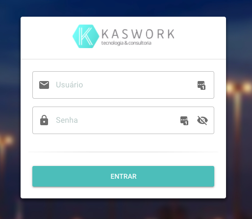
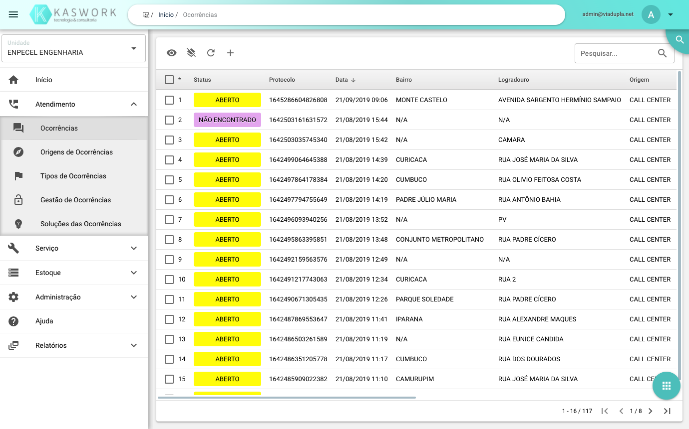

# Symfony | Análise Habilidades Técnica

## Kaswork

#### Resumo

Esse é um **projeto privado** que já está em produção. Esse projeto administra ocorrências de uma companhia de energia, tais como ocorrências, materiais, estoque, acompanhamento e etc.

#### Especificações Técnicas

Esse projeto foi desenvolvido com [Vue.js](https://vuejs.org) com [Quasar](https://quasar.dev) para frontend, no qual fiz parte de algumas partes do desenvolvimento e a API com [Symfony 4](https://symfony.com).

Sempre que trabalho com Frameworks, principalmente full stack, eu sempre crio abstrações para poder tornar o desenvolvimento um pouco mais orgânico e também deixar entidades o mais reutilizável e desacopladas possível.

Aqui vão alguns screenshots da aplicação:

##### Tela de Login



##### Ocorrências



Vou mostrar aqui uma camada de abstração que fiz para todas as Entities:

##### AbstractEntity

Aqui é a classe base (abstrata) para as todas as Entidades da aplicação que usam Doctrine e ainda dividi e contextualizei seus métodos em traits, para dá uma pouco mais flexibilidade de montar entidades mais complexas:

```php
namespace App\Core\Entity;

use App\Core\Entity\Entity\Entity;
use App\Core\Entity\Entity\ExcludeEntity;
use App\Core\Entity\Entity\FieldsEntity;
use App\Core\Entity\Entity\ResponsibleEntity;
use Gedmo\SoftDeleteable\Traits\SoftDeleteableEntity;
use Gedmo\Timestampable\Traits\TimestampableEntity;
use JsonSerializable;

/**
 * Class AbstractEntity
 * @package App\Core\Entity
 */
abstract class AbstractEntity implements EntityInterface, JsonSerializable
{
    /**
     * @trait
     */
    use Entity, FieldsEntity, ResponsibleEntity, TimestampableEntity, SoftDeleteableEntity, ExcludeEntity;
}
```

##### Entity

Essa é a trait entity que tem as operações mais básicas e genéricas para uma entity, acredito que quase todas as entidades usem essas trait:

```php
namespace App\Core\Entity\Entity;

use JMS\Serializer\Annotation as Serializer;
use RuntimeException;

/**
 * Trait Entity
 * @package App\Core\Entity\Entity
 */
trait Entity
{
    /**
     * @var array
     *
     * @Serializer\Exclude()
     */
    private $filled = [];

    /**
     * @param string $field
     * @return mixed
     */
    public function get(string $field)
    {
        $capitalized = ucfirst($field);
        $method = "get{$capitalized}";
        return call_user_func_array([$this, $method], []);
    }

    /**
     * @param string $field
     * @param mixed $value
     * @return mixed
     */
    public function set(string $field, $value)
    {
        $capitalized = ucfirst($field);
        $method = "set{$capitalized}";
        call_user_func_array([$this, $method], [$value]);
        return $this;
    }

    /**
     * is triggered when invoking inaccessible methods in an object context.
     *
     * @param $name string
     * @param $arguments array
     * @return mixed
     * @link https://php.net/manual/en/language.oop5.overloading.php#language.oop5.overloading.methods
     */
    public function __call($name, $arguments)
    {
        if (substr($name, 0, 3) === 'get') {
            $field = lcfirst(substr($name, 3));
            if (isset($this->$field)) {
                return $this->$field;
            }
            return null;
        }
        if (substr($name, 0, 3) === 'set') {
            $field = lcfirst(substr($name, 3));
            $value = array_shift($arguments);
            $this->$field = $value;
            return $this;
        }
        throw new RuntimeException("Method '{$name}' not found");
    }

    /**
     * @param string $field
     * @return mixed
     */
    public function getFilled(string $field)
    {
        if (isset($this->filled[$field])) {
            return $this->filled[$field];
        }

        return null;
    }

    /**
     * @param string $field
     * @param mixed $value
     * @return mixed
     */
    public function setFilled(string $field, $value)
    {
        $this->filled[$field] = $value;
        return $this;
    }

    /**
     * @param array $data
     */
    public function fill(array $data)
    {
        $notSettable = array_merge(
            array_keys($this->manyToMany()),
            array_keys($this->manyToOne()),
            array_keys($this->oneToMany()),
            $this->notMassFillable()
        );

        foreach ($data as $field => $datum) {
            if ($field === 'filled') {
                continue;
            }

            if (in_array($field, $notSettable, true)) {
                $this->setFilled($field, $datum);
                continue;
            }

            $this->set($field, $datum);
        }
    }

    /**
     * @return array
     */
    public function notMassFillable(): array
    {
        return ['id', 'uuid', 'createdBy', 'createdAt', 'updatedBy', 'updatedAt', 'deletedBy', 'deletedAt'];
    }

    /**
     * @return array
     */
    public function manyToMany(): array
    {
        return [];
    }

    /**
     * @return array
     */
    public function manyToOne(): array
    {
        return [];
    }

    /**
     * @return array
     */
    public function oneToMany(): array
    {
        return [];
    }

    /**
     * @return array
     */
    public function sorter(): array
    {
        return ['createdAt' => 'ASC'];
    }

    /**
     * @return array
     */
    public function getValues (): array
    {
        return get_object_vars($this);
    }
}
```

##### FieldsEntity

Essa trait são para métodos e propriedades que precisam do uso do `id` e do `uuid`.

```php
namespace App\Core\Entity\Entity;

use DateTime;
use Doctrine\ORM\Mapping as ORM;
use Gedmo\Mapping\Annotation as Gedmo;
use JMS\Serializer\Annotation as Serializer;
use Ramsey\Uuid\UuidInterface;

/**
 * Trait EntityDefaultFields
 * @package App\Core\Entity\Entity
 */
trait FieldsEntity
{
    /**
     * The internal primary identity key.
     *
     * @var UuidInterface
     * @ORM\Id
     * @ORM\Column(type="uuid_binary_ordered_time", unique=true)
     * @Serializer\Exclude()
     */
    protected $id;

    /**
     * @var UuidInterface
     * @ORM\Column(type="uuid", unique=true)
     * @Serializer\Type("string")
     */
    protected $uuid;

    /**
     * @return UuidInterface
     */
    public function getId()
    {
        return $this->id;
    }

    /**
     * @param mixed $id
     * @SuppressWarnings(PHPMD.ShortVariable)
     */
    public function setId($id)
    {
        $this->id = $id;
    }

    /**
     * @return UuidInterface
     */
    public function getUuid(): ?UuidInterface
    {
        return $this->uuid;
    }

    /**
     * @param UuidInterface $uuid
     * @return $this
     */
    public function setUuid(UuidInterface $uuid)
    {
        $this->uuid = $uuid;
        return $this;
    }

    /**
     * Specify data which should be serialized to JSON
     * @link https://php.net/manual/en/jsonserializable.jsonserialize.php
     * @return mixed data which can be serialized by <b>json_encode</b>,
     * which is a value of any type other than a resource.
     * @since 5.4.0
     */
    public function jsonSerialize()
    {
        $values = get_object_vars($this);
        unset($values['id']);
        return $values;
    }
}
```

##### ResponsibleEntity

Essa trait guarda as propriedades e métodos que dizem respeito a responsabilidades de criação, atualização e deleção de registros. Aqui ele configura tanto data/hora da ação como também quem executou a ação:

```php
namespace App\Core\Entity\Entity;

use App\Entity\Auth\User;
use DateTime;
use Doctrine\ORM\Mapping as ORM;
use Gedmo\Mapping\Annotation as Gedmo;
use JMS\Serializer\Annotation as Serializer;

/**
 * Trait ResponsibleEntity
 * @package App\Core\Entity\Entity
 *
 * @method $this setCreatedBy(string $createdBy)
 * @method string getCreatedBy()
 * @method $this setUpdatedBy(string $updatedBy)
 * @method string getUpdatedBy()
 * @method $this setDeletedBy(string $deletedBy)
 * @method string getDeletedBy()
 * @method $this setCreatedAt(DateTime $createdAt)
 * @method DateTime getCreatedAt()
 * @method $this setUpdatedAt(DateTime $updatedAt)
 * @method DateTime getUpdatedAt()
 * @method $this setDeletedAt(DateTime $deletedAt)
 * @method DateTime getDeletedAt()
 */
trait ResponsibleEntity
{
    /**
     * @var string
     * @Serializer\SerializedName("createdBy")
     * @Gedmo\Blameable(on="create")
     * @ORM\Column(type="string", nullable=true)
     */
    protected $createdBy;

    /**
     * @var string
     * @Serializer\SerializedName("updatedBy")
     * @Gedmo\Blameable(on="update")
     * @ORM\Column(type="string", nullable=true)
     */
    protected $updatedBy;

    /**
     * @var string
     * @Serializer\SerializedName("deletedBy")
     * @ORM\Column(type="string", nullable=true)
     */
    protected $deletedBy;

    /**
     * @var DateTime
     * @Serializer\SerializedName("createdAt")
     * @Gedmo\Timestampable(on="create")
     * @ORM\Column(type="datetime")
     * @Serializer\Type("DateTime<'Y-m-d H:i'>")
     */
    protected $createdAt;

    /**
     * @var DateTime
     * @Serializer\SerializedName("updatedAt")
     * @Gedmo\Timestampable(on="update")
     * @ORM\Column(type="datetime")
     * @Serializer\Type("DateTime<'Y-m-d H:i'>")
     */
    protected $updatedAt;

    /**
     * @var DateTime
     * @Serializer\SerializedName("deletedAt")
     * @ORM\Column(type="datetime", nullable=true)
     * @Serializer\Type("DateTime<'Y-m-d H:i'>")
     */
    protected $deletedAt;

    /**
     * @param User $session
     */
    public function creating(User $session)
    {
        $responsible = $this->parseResponsible($session);
        $this->createdBy = $responsible;
        $this->updatedBy = $responsible;
    }

    /**
     * @param User $session
     */
    public function updating(User $session)
    {
        $this->updatedBy = $this->parseResponsible($session);
    }

    /**
     * @param User $session
     */
    public function deleting(User $session)
    {
        $this->deletedBy = $this->parseResponsible($session);
    }

    /**
     * @param User $session
     */
    public function restoring(User $session)
    {
        $this->updatedBy = $this->parseResponsible($session);
    }

    /**
     * @param User $session
     * @return string
     */
    protected function parseResponsible(User $session)
    {
        $name = strtoupper($session->getName());
        $uuid = $session->getUuid();
        return "{$name} [{$uuid}]";
    }
}
```

##### RelationProperties

Essa acho que é uma das traits que mais me ajudou, pois ela resolve toda parte de relacionamento do Doctrine, que as vezes fazendo na mão torna o trabalho um pouco massante.

```php
namespace App\Core\Entity\Entity;

/**
 * Class RelationProperties
 * @package App\Core\Entity\Entity
 */
class RelationProperties
{
    /**
     * @var string
     */
    protected $field;

    /**
     * @var string
     */
    protected $repository;

    /**
     * RelationProperties constructor.
     * @param string $field
     * @param string $repository
     */
    public function __construct(string $field, string $repository)
    {
        $this->field = $field;
        $this->repository = $repository;
    }

    /**
     * @param string $field
     * @param string $repository
     * @return RelationProperties
     */
    public static function build(string $field, string $repository)
    {
        return new static($field, $repository);
    }

    /**
     * @return string
     */
    public function getField(): string
    {
        return $this->field;
    }

    /**
     * @return string
     */
    public function getRepository(): string
    {
        return $this->repository;
    }
}
```
